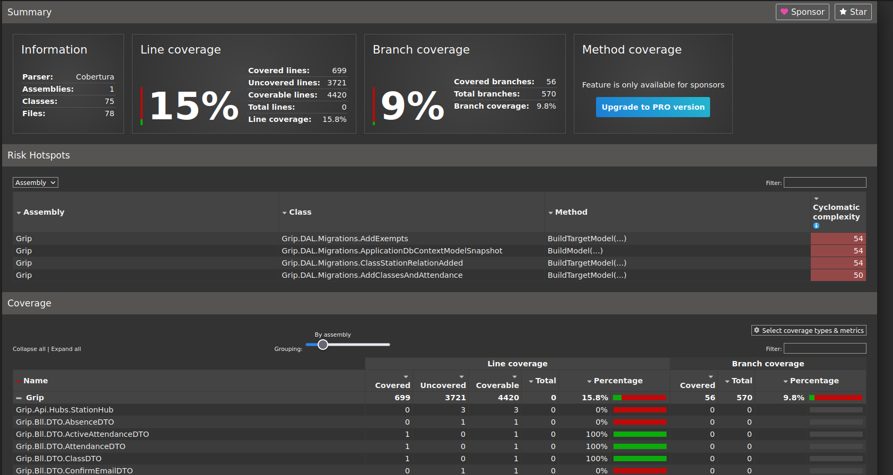

# Unit tesztek
## Technológia
A tesztek az NUnit nevű keretrendszerrel készültek. Mock-ok előállításához a Moq keretrendszert válaszottam, illetve az EntityFramework által biztosított adatbázis elérés mockolására a Moq-ot kiegészítő Moq.EntityFrameworkCore könyvtárat választottam.
## Tesztelt osztályok
### Services
A következő osztályok kreültek tesztelésre a névterekre bontva:
#### Grip.Bll.Services
- AttendanceService
- ClassService
- ExemptService
- StationService
#### Grip.Api.Controllers
- StationController

# Code coverage
Az analizáláshoz a `dotnet-coverage` nevű dotnet által biztosított eszközt használtam. 

Az exportált XML állományból a `dotnet-reportgenerator-globaltool` nevű eszköz segítségével html formájú reportot generáltam:

# Összefoglalás
A projekbe előkészítettem a teszteléshez szükséges eszközöket, így a projekt további tesztelése könnyebben megvalósítható lesz, illetve a legkritikusabb osztályokhoz el is készítettem a teszteket.