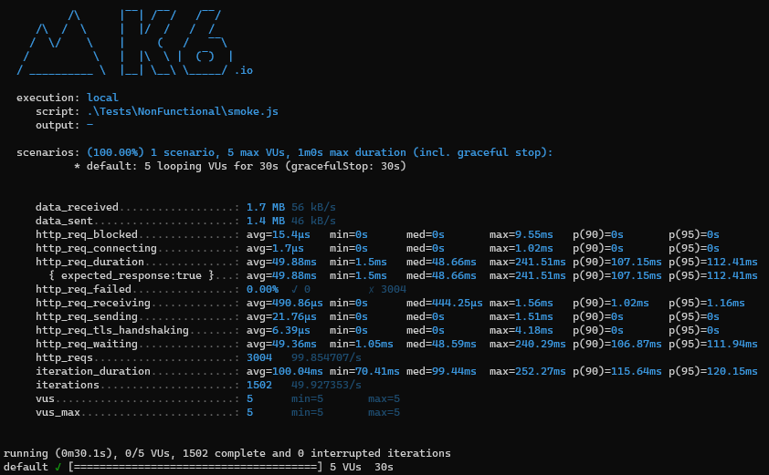
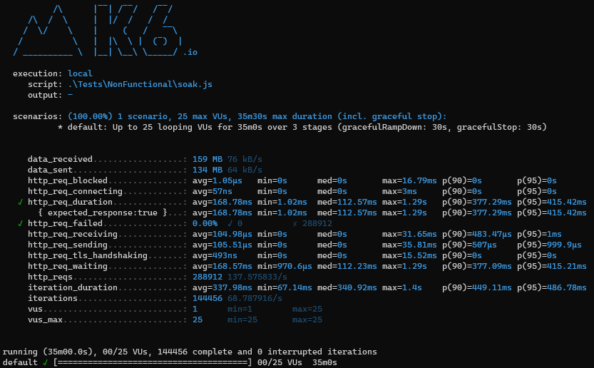
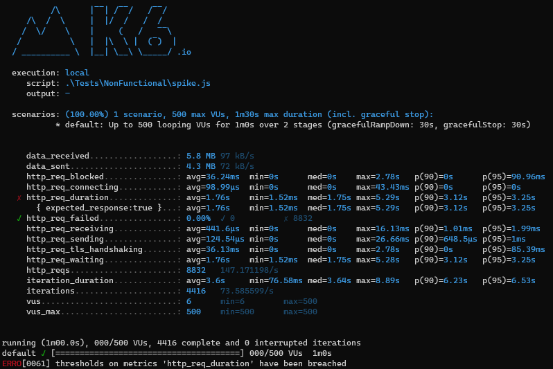
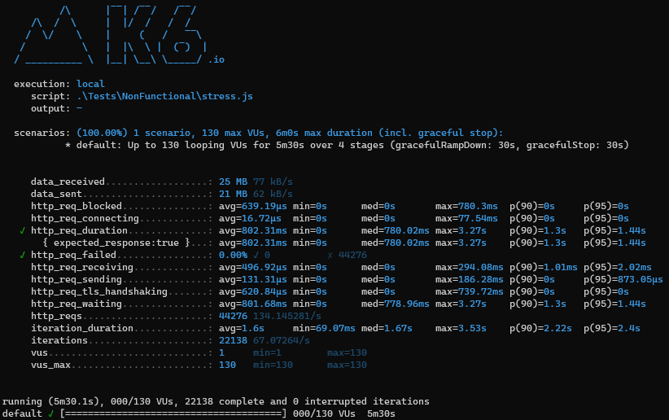
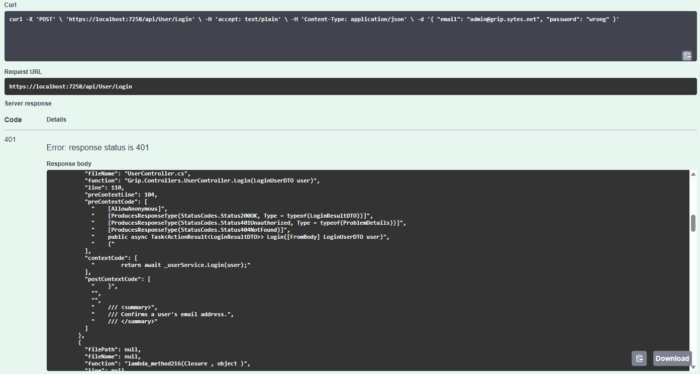

# Nem-funkcionális jellemzők vizsgálata

## Teljesítmény
4 különböző terheléstesztet végeztem.

### Smoke teszt:
Alacsony terhelés rövid ideig.\
Az átlagos válaszidő kb. 50ms és nincs sikertelen kérés.

### Soak teszt:
Átlagos terhelés hosszú ideig.\
Megkötések:\
Sikertelen kérések maximális aránya: 0.1% - teljesül\
Kérések 95%-a 0.5 másodperc alatt lezajlik - teljesül

### Spike teszt:
Nagyon magas terhelés hirtelen, rövid ideig.\
Követelményként megadásra került, hogy a kérések kevesebb mint 1%-a lehet csak sikertelen, ami teljesült is. Viszont az elvárás, hogy a kérések 95%-a 3 másodperc alatt teljesüljön, nem valósult meg.

### Stressz teszt:
Megemelkedett terhelés közepesen hosszú ideig.\
Az elvárások, hogy a kérések kevesebb mint 0.5%-a lehet sikertelen, valamint a 95%-a 1.5 másodperc alatt kell teljesüljön mind megvalósult.

## Biztonság
Az alkalmazás biztonsági szempontból való vizsgálata során azt találtam, hogy az api például egy helytelen adatokkal való belépés esetében a válasz body részében visszaadja a stack trace-t, forráskód sorok is láthatók. Az ilyen részletességű hibaleírás bekerülhet a logfájlba, de a felhasználónak ne kerüljön elküldésre, mivel részleteket fed fel az implementációról, a használt technológiáról, ezáltal a lehetséges sebezhetőségekről.

