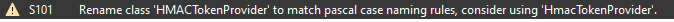
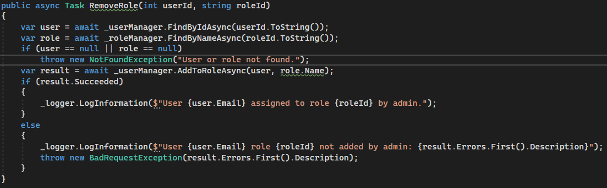

# Api mappa

Nem használt függvények mezők törlése, ifek mergelése, elnevezeséi konvenciókhoz való iagzodás, mind a kód olvashatósága és karbantarthatósága érdekében. 

Ebben az esetben hibásan jelzi a PascalCase megsértését.

# Bll

Nem használt lokális változók törlése, csak a konstruktorban beállított tagok readonly-vá és priváttá tétele. Paraméterek átnevezése, hogy egyezzen az interfész által deklarálttal. Kikommentezett kódok 
törlése. 

RemoveRole, AddRoleként viselkedett, cseréltem őket és implementáltam a RemoveRolet.